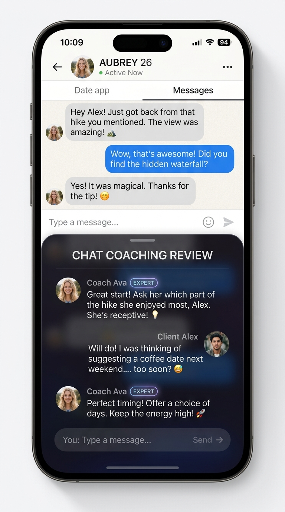
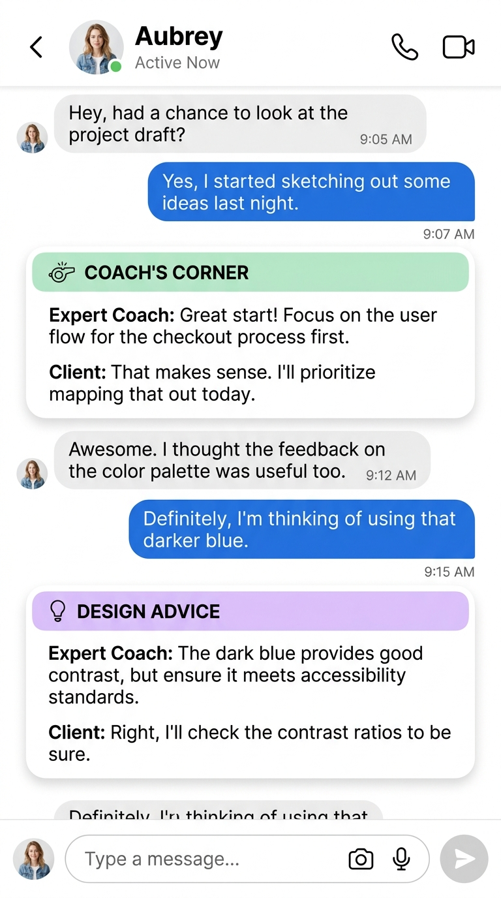
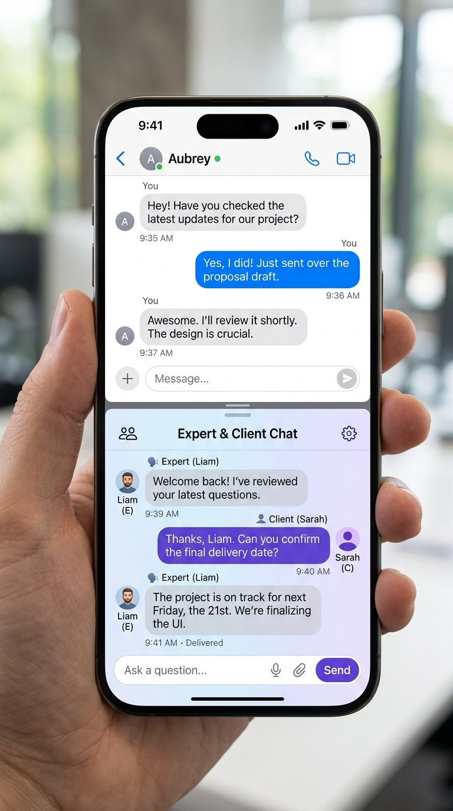

# Expert & Client Chat Dialogue UI Concepts

This document presents design concepts for integrating an **Expert & Client** dialogue stream alongside the **Aubrey Chat View** in Hinge Tracker.

---

## Visual Mockups

````carousel

### Concept A: Floating Bottom Sheet Overlay
- **Description**: A dark glassmorphism slide-up/collapsible drawer positioned at the bottom of the screen containing the real-time Expert & Client conversation.
- **Key Advantage**: Leaves the main Aubrey chat layout unchanged in full screen, allowing the coaching stream to be toggled or minimized easily.
- **Best For**: Real-time coaching overlay and collapsible review sessions.

<!-- slide -->

### Concept B: In-Line Callout Cards
- **Description**: Distinctly styled coaching cards (e.g., "Coach's Corner" / "Design Advice") inserted chronologically into the main chat body directly beneath the message being discussed.
- **Key Advantage**: Precise contextual association right next to each specific chat bubble.
- **Best For**: Detailed message-by-message teardowns and post-analysis review.

<!-- slide -->

### Concept C: Split-Screen Dual Pane
- **Description**: A 50/50 vertically divided view featuring Aubrey's chat in the top pane and the dedicated Expert & Client chat channel in the bottom pane.
- **Key Advantage**: Equal visual prominence for simultaneous two-way chatting.
- **Best For**: Interactive parallel conversations and side-by-side active feedback.
````

---

## Detailed Summary & Comparison

| Concept | Layout Style | Key Strengths | Considerations |
| :--- | :--- | :--- | :--- |
| **Concept A: Floating Sheet** | Collapsible slide-up drawer overlay | Full-screen Aubrey chat maintained; easy toggle | Partial temporary overlap of bottom chat bubbles |
| **Concept B: In-Line Cards** | Embedded cards inside message stream | Direct visual connection to specific messages | Lengthens vertical scroll area of main chat |
| **Concept C: Dual Pane** | 50/50 split screen (Top: Aubrey, Bottom: Expert) | Equal weight to both chat streams simultaneously | Reduced vertical viewing area per pane |

---

## Next Steps
Once your team selects a preferred concept:
1. We will define the data schema for Expert and Client messages.
2. Implement the chosen layout component in [`index.html`](file:///Users/khandpv1/Desktop/.AntiGrav/hinge-tracker/index.html).
